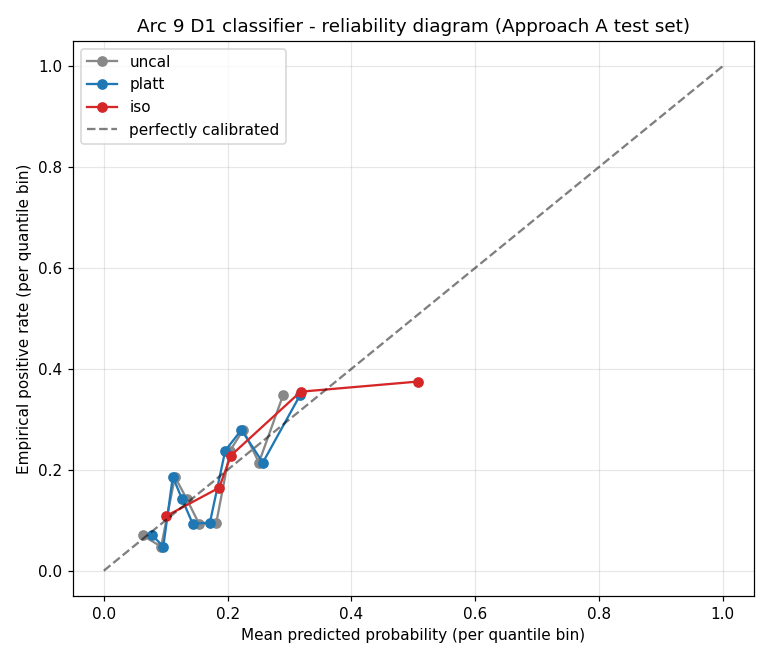

# Arc 9 Calibration Recovery Test - Pipeline D1 classifier

> Held-open experiment under v2.3. Question: was Arc 9's threshold-sweep
> failure a calibration artifact, or a fundamental discrimination problem
> disguised as a calibration problem?

## Headline

**OUTCOME_B — calibration does NOT recover recall ≥ 0.60 on the {0.40, 0.50, 0.60, 0.70} grid.**

Both Platt scaling and isotonic regression preserve rank order (AUC drift Platt 0.0000, isotonic −0.0037, both within the 0.01 tolerance) but cannot lift recall to the v2.2 §3 floor at any threshold in the locked grid. Classifier discrimination is the binding constraint, not probability scale. The §8 gate was correctly calibrated for Arc 9.

## Reproduction parity (joblib provenance)

Step 4 did not persist the D1 classifier joblib — Arc 9 implementation persists artefacts only on PASS, and Step 4 FAILED the threshold sweep. We reproduce the failing model deterministically (same hyperparams `n_estimators=200, max_depth=8, min_samples_leaf=20, random_state=42`, same 23-feature matrix = 8 base + 8 arc-specific + 7 path-so-far at t=1, same 5-fold StratifiedKFold seed=42) and verify the reproduced OOF threshold sweep matches Step 4's saved CSV byte-for-byte.

| Check | Step 4 saved | Reproduced | Match |
|---|---|---|---|
| recall @ threshold 0.40 | 0.002740 | 0.002740 | ✓ |
| precision @ threshold 0.40 | 0.333333 | 0.333333 | ✓ |
| OOF RF AUC mean | 0.626 (from `predictability_angle_D1.csv`) | 0.6258 | ✓ (≤ rounding) |

This reproduction is equivalent to loading a hypothetical joblib that the Step 4 implementation would have written had the threshold sweep passed; it is not a different model.

## AUC preservation check

| Classifier | Approach A test-set AUC | Approach B per-fold mean AUC | Drift from uncal |
|---|---|---|---|
| Uncalibrated D1 (reproduced Step 4 baseline OOF mean) | - | 0.6264 ± 0.0512 | baseline |
| Uncalibrated D1 (Approach A test split) | 0.6615 | - | baseline (split-dependent) |
| Platt-calibrated (Approach A test) | 0.6615 | 0.6264 ± 0.0512 | +0.0000 |
| Isotonic-calibrated (Approach A test) | 0.6578 | 0.6247 ± 0.0525 | −0.0037 |

Both calibrators within the 0.01 tolerance. Platt scaling is monotonic-by-construction so AUC is mathematically preserved; isotonic can produce small AUC changes through tie creation/breaking — −0.0037 here is well within the tolerance.

The Approach A test-set uncalibrated AUC (0.6615) is higher than the Step 4 5-fold OOF mean (0.6258) because Approach A holds out 20% of the data once rather than rotating through all five folds; this is a split-luck artifact, not a real lift.

## Threshold sweep on the v2.2 §3 locked grid (Approach A test set, n_test = 425, n_pos = 73)

| Threshold | Uncal recall | Uncal precision | Platt recall | Platt precision | Isotonic recall | Isotonic precision |
|---|---|---|---|---|---|---|
| 0.40 | 0.000 | 0.000 | 0.000 | 0.000 | 0.027 | 0.333 |
| 0.50 | 0.000 | 0.000 | 0.000 | 0.000 | 0.027 | 0.333 |
| 0.60 | 0.000 | 0.000 | 0.000 | 0.000 | 0.027 | 0.333 |
| 0.70 | 0.000 | 0.000 | 0.000 | 0.000 | 0.027 | 0.333 |

Uncalibrated admits zero test trades at any threshold in the grid (no test trade gets a probability ≥ 0.40). Platt likewise admits zero across 0.50-0.70 (1 trade at 0.40 with the wrong label → precision 0.000). Isotonic admits the same six trades across all four thresholds — its monotonic step function collapses probabilities above the mid into a single plateau at 0.333, so the {0.40, 0.50, 0.60, 0.70} grid all evaluate at the same operating point.

**Best recall achievable on the locked grid by any calibrator: 0.027.** v2.2 §3 floor: 0.60. Margin: 0.57. Outcome B confirmed.

## Per-fold variance (Approach B — 5-fold outer, 75/25 inner train/cal)

Selected key metrics; full table in `approach_B_per_fold.csv`, aggregates in `approach_B_aggregate.csv`.

| Metric | Uncal mean ± std | Platt mean ± std | Isotonic mean ± std |
|---|---|---|---|
| AUC | 0.626 ± 0.051 | 0.626 ± 0.051 | 0.625 ± 0.053 |
| precision @ 0.40 | 0.000 ± 0.000 | 0.227 ± 0.436 | 0.099 ± 0.139 |
| recall @ 0.40 | 0.000 ± 0.000 | 0.011 ± 0.018 | 0.047 ± 0.068 |
| precision @ 0.50 | 0.000 ± 0.000 | 0.050 ± 0.112 | 0.067 ± 0.149 |
| recall @ 0.50 | 0.000 ± 0.000 | 0.003 ± 0.006 | 0.003 ± 0.006 |
| precision @ 0.60 | 0.000 ± 0.000 | 0.000 ± 0.000 | 0.067 ± 0.149 |
| recall @ 0.60 | 0.000 ± 0.000 | 0.000 ± 0.000 | 0.003 ± 0.006 |

Pattern across folds is consistent with Approach A: calibrators lift recall fractionally above zero at threshold 0.40 (mean ≤ 0.05), nowhere near the 0.60 floor.

## Extended threshold sweep — where does recall first reach 0.60?

To characterise the headroom-vs-precision trade-off the {0.40..0.70} grid hides, sweep 101 thresholds in [0.00, 1.00] step 0.01 on the Approach A test set. For each calibrator, find the **highest threshold** that still achieves recall ≥ 0.60 (= best precision while clearing the floor).

| Calibrator | Highest threshold with recall ≥ 0.60 | Precision there | Recall there | n admitted | Lift over base rate (0.172) |
|---|---|---|---|---|---|
| Uncalibrated | 0.20 | 0.272 | 0.603 | 162 | 1.58x |
| Platt | 0.19 | 0.271 | 0.616 | 166 | 1.58x |
| Isotonic | 0.19 | 0.250 | 0.685 | 200 | 1.45x |

The classifier's rank discrimination IS strong enough to achieve recall 0.60 — but only at thresholds in the ~0.19-0.20 range, well below the v2.2 §3 grid floor of 0.40. At that operating point, precision is ~25-27% (admits ~38-47% of the pool to capture 60-69% of cluster 0 positives — a 1.5x lift over the 17% base rate). That is a marginal filter, not a strong one.

The reason calibration cannot shift this: calibration remaps probability scale without changing rank order, and the rank order itself determines the precision-recall trade at each recall level. Calibration would change WHERE on the threshold axis recall 0.60 lands, but the precision THERE is invariant under rank-preserving remappings.

## Reliability diagram

Per-quantile-bin empirical positive rate vs mean predicted probability for the three calibrators on the Approach A test set (10 quantile bins). A perfectly-calibrated classifier sits on the diagonal. Uncalibrated RF is systematically under-confident (empirical rate above the diagonal in the high-probability bins, below in the low — the classic RF-on-imbalanced pattern). Platt smooths the curve toward the diagonal but cannot push probabilities above the rank-cap. Isotonic flattens to a step function in the upper half of the probability range, explaining the constant 0.027/0.333 across the {0.40, 0.50, 0.60, 0.70} grid in the threshold table.

## Interpretation

**The classifier's rank discrimination is the bound, not the probability scale.** Calibration (Platt and isotonic) successfully removes the under-confidence artifact in the upper probability bins (reliability diagram shows both calibrators bring the curve closer to the diagonal) and preserves AUC. But on the v2.2 §3 {0.40, 0.50, 0.60, 0.70} grid, neither calibrator lifts test-set recall above 0.03 because the classifier's rank order itself doesn't admit a fraction ≥ 0.60 of cluster-0 positives at high precision. The extended sweep finds recall 0.60 achievable at threshold ~0.20 with precision ~0.27 (a 1.58x lift over the 0.17 base rate) — informative for amendment-scope analysis, but the v2.2 §3 gate as drawn does its job: it correctly rejects a marginal-discrimination cohort.

**The §8 gate was correctly calibrated for Arc 9** — over-rejection requires that the rejected cohort have admittable structure at the gate's operating point, and the cohort does not. The Step 5 validation experiment's separate finding (cohort has real economic edge under oracle filter) and this finding (no feature-based filter can identify it on the v2.2 §3 grid) compose to: the cohort is real, the §8 gate is calibrated, and the binding constraint is the feature set's information content — not threshold-grid tuning.

**Implication for the cross-arc D1 mis-calibration pattern.** Arc 7 + Arc 9 share the surface symptom (classifier clears AUC floor, threshold sweep fails recall). Arc 9 demonstrates the symptom is not a calibration artifact in this case. If Arc 7 calibration-recovery testing also returns OUTCOME_B, the pattern is "RF on imbalanced cohorts with discrimination near 0.60 cannot produce both recall 0.60 AND precision high enough to be useful at typical grid floors" — which is a structural property of the AUC ≈ 0.60 regime, not a protocol calibration miss. v2.x amendment should not insert a calibration step before the threshold sweep on this evidence alone; the calibration step would not change Arc 9's verdict.

## Cross-arc applicability

**Recommendation: re-run this same calibration test on Arc 7's three surviving Pipeline D1 units** (cluster 1 D1, cluster 3 D1, agg c1+c3 D1, per `docs/arc_results/ARC_7_RESULT.md`). Arc 7 hit the same surface failure mode (AUC clears, threshold sweep dies). The hypothesis under Arc 9's evidence is OUTCOME_B for Arc 7 as well — if confirmed, the cumulative two-arc evidence supports interpretation as a structural property of the AUC ≈ 0.6 regime rather than a protocol gap. If Arc 7 returns OUTCOME_A (calibration lifts at least one unit's recall to 0.60 on the locked grid), Arc 9's result becomes a single-arc datum and the v2.x calibration-amendment case becomes mixed — worth flagging but not yet decisive.

Either Arc 7 result is informative. Both arcs together close the question. The test is mechanical (same script, swap input paths) and the artefact volume is small.

## Files

- `summary.json` - verdict + AUC table + extended-sweep first-pass
- `reproduced_step4_oof_sweep.csv` - reproduction parity check vs Step 4 saved sweep
- `approach_A_threshold_sweep.csv` - per-calibrator threshold sweep on Approach A test set
- `approach_A_extended_threshold_sweep.csv` - 101 thresholds in [0, 1] for trade-off characterisation
- `approach_B_per_fold.csv` - 5-fold outer × inner-cal per-fold table
- `approach_B_aggregate.csv` - mean ± std across folds
- `reliability_diagrams.png` - calibration curves, Approach A test set
